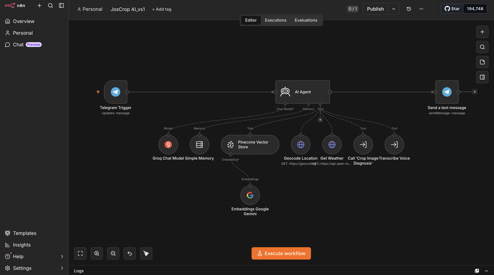
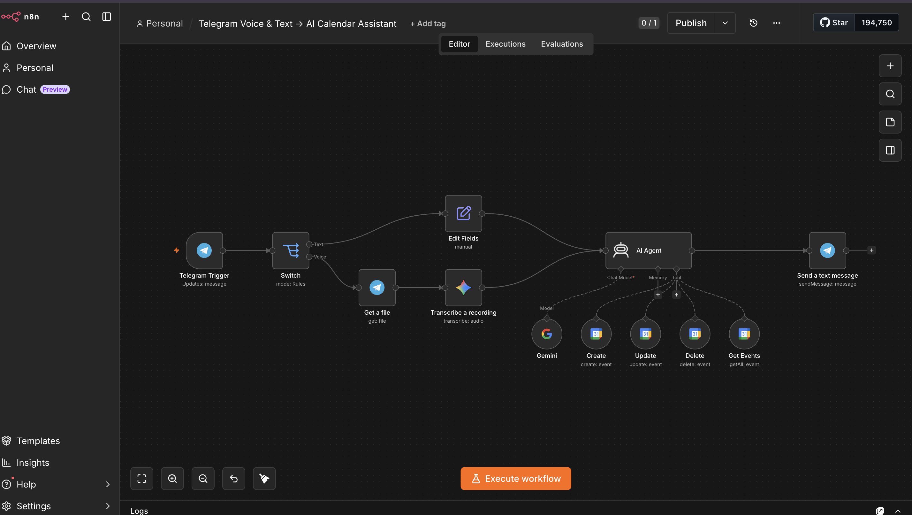
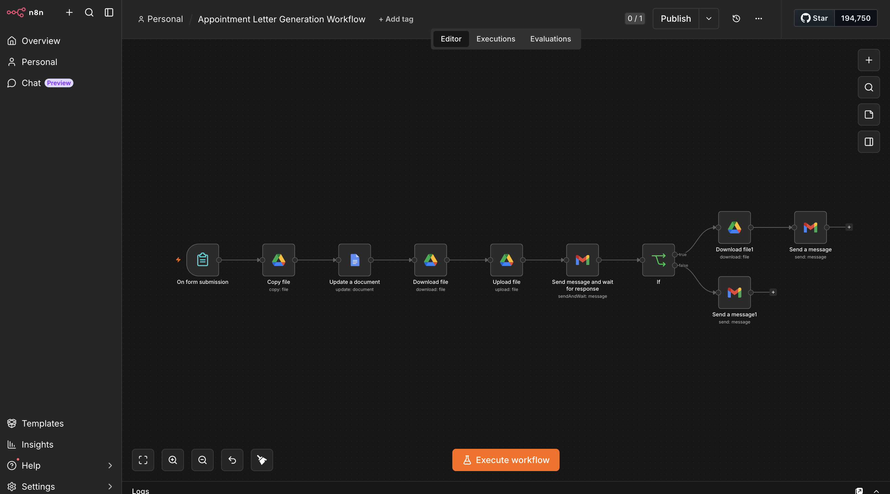
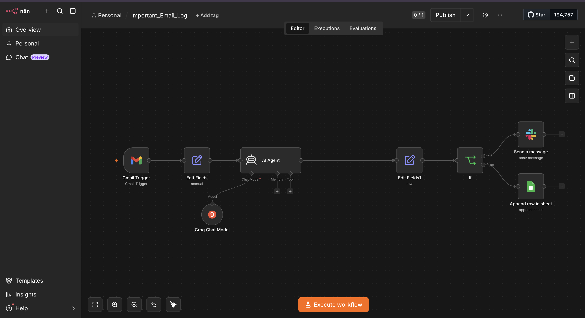
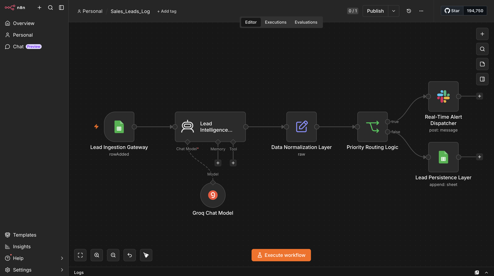
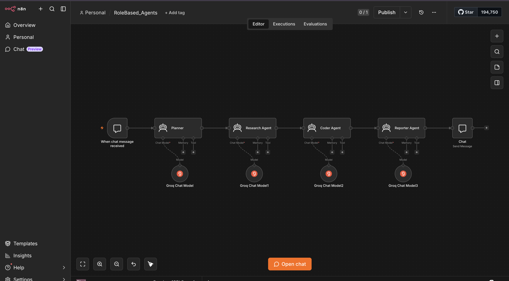

# AI Automation Projects

A portfolio of AI-powered automation workflows built in **n8n** — combining AI agents, LLM APIs, and connected tools to solve real, practical problems.

Each workflow below is production-style: a trigger, a chain of steps, and (in most) an AI agent making decisions in the middle.

> **Stack across projects:** n8n · AI Agents · Groq / Google Gemini · LLM APIs · Telegram · Gmail · Google Sheets · Google Calendar · Pinecone · Docker

---

## 1. JosCrop AI — Telegram Crop Diagnosis Assistant

An AI assistant on Telegram that helps farmers diagnose crop problems and get local, weather-aware guidance — by text or voice.

**What it does:**
- Accepts text **and** voice messages (voice is transcribed automatically)
- Uses an AI Agent with tools: crop-image diagnosis, weather lookup, and location geocoding
- Pulls knowledge from a Pinecone vector store for grounded, relevant answers
- Replies straight back in the Telegram chat

**Stack:** Telegram · AI Agent · Groq · Google Gemini Embeddings · Pinecone · Weather & Geocoding APIs

---

## 2. Telegram Voice & Text → AI Calendar Assistant

Manage your Google Calendar by simply messaging a Telegram bot — type or talk, the AI handles the rest.

**What it does:**
- Routes incoming messages: text goes one way, voice gets transcribed first
- An AI Agent interprets the request and creates, updates, deletes, or fetches calendar events
- Confirms back to the user in chat

**Stack:** Telegram · Switch routing · Transcription · AI Agent · Google Gemini · Google Calendar

---

## 3. Appointment Letter Generation Workflow

Automates the full lifecycle of generating and sending an appointment letter — with a human approval checkpoint before anything goes out.

**What it does:**
- Starts from a form submission
- Copies a template, fills the document, downloads and re-uploads it
- Sends for approval and **waits for a human response**
- Branches: approved → deliver the letter by email; not approved → send a follow-up

**Stack:** Form trigger · Google Drive · Google Docs · Gmail · conditional (If) logic

---

## 4. Important Email Log — AI Email Triage

Reads incoming Gmail, uses AI to judge what's important, then logs it and alerts you — so nothing critical slips through.

**What it does:**
- Triggers on new Gmail messages
- An AI Agent evaluates and classifies each email
- Branches: important → post to Slack; otherwise → log the record to Google Sheets

**Stack:** Gmail · AI Agent · Groq · conditional logic · Slack · Google Sheets

---

## 5. Smart Sales Reporter

Turns raw sales-sheet data into an AI-written summary report, delivered straight to an inbox.

**What it does:**
- Reads rows from a Google Sheet on demand
- Runs a Python step to process the data
- An AI Agent writes a clear, readable sales summary
- Emails the finished report

**Stack:** Google Sheets · Python · AI Agent · Google Gemini · Gmail

---

## 6. RoleBased Agents — Multi-Agent System

A chain of specialised AI agents that pass work down the line — mimicking how a real team divides a task.

**What it does:**
- **Planner** breaks down the request → **Research Agent** gathers info → **Coder Agent** builds → **Reporter Agent** writes the final output
- Each agent runs on its own model instance
- Final response returned in chat

**Stack:** Chat trigger · 4 chained AI Agents · Groq

---

## About

Built by **Raji Adebayo** — AI Automation Engineer based in Jos, Nigeria, focused on practical automation for the development sector and beyond.

📫 [LinkedIn](https://www.linkedin.com/in/rajiadebayo/)

Updated from my Mac via Git.
